## Architecture (Mermaid)

```mermaid
flowchart LR

  Client[Web/Mobile] --> Gateway[API Gateway]

  Gateway --> Product[Product Service]

  Gateway --> User[User Service]

  Gateway --> Payment[Payment Service]

  Product --> Redis[(Redis Cache)]

  Product --> Kafka

  User --> Kafka

  Kafka --> Email[Email Service]

  Product --> AI[Spring AI / OpenAI]

  classDef svc fill:#000,stroke:#333,stroke-width:1px;

  class Product,User,Payment,Email svc;
```



## User Management API Testing

The application exposes a JWT-based user management module under the `com.rehi.productservicedrehicapstone` package.
This section provides ready-to-use examples for registering a user, logging in, and accessing the authenticated profile.

> Replace `localhost:8080` if your server is running on a different host or port.

### 1. Register a New User

**Endpoint:** `POST /api/auth/register`  
**Description:** Creates a new user account and returns a JWT token with basic user info.  
**Default Role:** `CUSTOMER`

```bash
curl -X POST "http://localhost:8080/api/auth/register" \
  -H "Content-Type: application/json" \
  -d '{
    "email": "d.r@example.com",
    "password": "StrongPassword123",
    "firstName": "D",
    "lastName": "R",
    "mobileNumber": "1234567890"
  }'
```

**Sample JSON request body:**

```json
{
  "email": "d.r@example.com",
  "password": "StrongPassword123",
  "firstName": "D",
  "lastName": "R",
  "mobileNumber": "1234567890"
}
```

The response will include a `jwtToken`, `userId`, and `username` (email).

### 2. Login and Copy the Token

**Endpoint:** `POST /api/auth/login`  
**Description:** Authenticates an existing user and returns a new JWT token.

```bash
curl -X POST "http://localhost:8080/api/auth/login" \
  -H "Content-Type: application/json" \
  -d '{
    "email": "d.r@example.com",
    "password": "StrongPassword123"
  }'
```

**Sample JSON request body:**

```json
{
  "email": "d.r@example.com",
  "password": "StrongPassword123"
}
```

From the JSON response, copy the value of the `jwtToken` field.  
This token will be used as a **Bearer token** in the `Authorization` header for secured endpoints.

### 3. Access the Profile Using the Bearer Token

**Endpoint:** `GET /api/users/profile`  
**Description:** Retrieves the profile of the currently authenticated user.  
**Authorization:** Requires a valid JWT token in the `Authorization` header.

```bash
TOKEN="PASTE_JWT_TOKEN_HERE"

curl -X GET "http://localhost:8080/api/users/profile" \
  -H "Authorization: Bearer $TOKEN"
```

### 4. Update the Profile Using the Bearer Token

**Endpoint:** `PUT /api/users/profile`  
**Description:** Updates non-sensitive profile details (first name, last name, mobile number).  
**Authorization:** Requires a valid JWT token.

```bash
TOKEN="PASTE_JWT_TOKEN_HERE"

curl -X PUT "http://localhost:8080/api/users/profile" \
  -H "Authorization: Bearer $TOKEN" \
  -H "Content-Type: application/json" \
  -d '{
    "userId": 1,
    "firstName": "Deep",
    "lastName": "Rehi",
    "mobileNumber": "9876543210",
    "email": "deep.rehi@example.com"
  }'
```

### 5. Reset Password Using the Bearer Token

**Endpoint:** `POST /api/auth/reset-password`  
**Description:** Resets the password for the currently authenticated user.  
**Authorization:** Requires a valid JWT token.

```bash
TOKEN="PASTE_JWT_TOKEN_HERE"

curl -X POST "http://localhost:8080/api/auth/reset-password" \
  -H "Authorization: Bearer $TOKEN" \
  -H "Content-Type: application/json" \
  -d '{
    "oldPassword": "StrongPassword123",
    "newPassword": "NewStrongPassword456"
  }'
```

If the old password is incorrect, the API will return a 401 Unauthorized error with a helpful error message handled by the global exception handler.

## Product Catalog API

The product catalog module uses the real MySQL database via Spring Data JPA repositories.
All endpoints are exposed under the `/api` base path.

> Replace `localhost:8080` with your actual host/port if needed.

### 1. Seed Dummy Category and Product

If you prefer to seed data directly in MySQL using the existing schema from `V1__init.sql`
(`category` and `product` tables with `id` and `name` columns), you can run:

```sql
INSERT INTO category (id, name, created_at, last_modified, is_deleted, description)
VALUES (1,
        'Electronics',
        NOW(),
        NOW(),
        0,
        'Electronics and gadgets');

INSERT INTO product (id,
                     name,
                     created_at,
                     last_modified,
                     is_deleted,
                     description,
                     image_url,
                     price,
                     category_id)
VALUES (1,
        'Sample Phone',
        NOW(),
        NOW(),
        0,
        'A sample smartphone for testing.',
        'https://example.com/images/phone.png',
        499.99,
        1);
```

Alternatively, you can insert similar rows via your favourite SQL client using the same column names.

### 2. Search for a Product

**Endpoint:** `GET /api/products?keyword=phone`  
**Description:** Searches products by matching the keyword in the product name or description (case-insensitive).

```bash
curl -X GET "http://localhost:8080/api/products?keyword=phone&page=0&size=10"
```

The response is a Spring Data `Page` structure containing `content` (an array of `ProductResponseDto` objects)
along with pagination metadata such as `totalElements`, `totalPages`, `number`, and `size`.

### 3. Browse Products by Category

**Endpoint:** `GET /api/categories/{categoryId}/products`  
**Description:** Returns products for a specific category with pagination support.

```bash
curl -X GET "http://localhost:8080/api/categories/1/products?page=0&size=10"
```

### 4. Pagination Example for All Products

**Endpoint:** `GET /api/products?page=0&size=5`  
**Description:** Fetches a paginated list of all products.

```bash
curl -X GET "http://localhost:8080/api/products?page=0&size=5"
```

You can adjust the `page` and `size` parameters to implement infinite scrolling or traditional paged views in the frontend.


## Cart & Checkout Flow

The cart and checkout module allows a user to add products to a cart, review the cart total, and place an order.
These examples assume you already have:

- At least one `product` row (see **Product Catalog API** seeding).
- A valid `userId` (e.g. `1` from the User Management module).

> Replace `localhost:8080` with your actual host/port if needed.

### 1. Add Item to Cart

**Endpoint:** `POST /api/carts/{userId}/items`  
**Description:** Adds a product to the user’s cart or updates the quantity if it already exists. Ensure the Bearer Token is added to the request

```bash
curl -X POST "http://localhost:8080/api/carts/1/items" \
  -H "Authorization: Bearer $TOKEN" \
  -H "Content-Type: application/json" \
  -d '{
    "productId": 1,
    "quantity": 2
  }'
```

The response contains the `CartDto` with `cartId`, `totalPrice`, and the list of `cartItems`.

### 2. View Cart

**Endpoint:** `GET /api/carts/{userId}`  
**Description:** Retrieves the current contents of the user’s cart including the computed `totalPrice`.

```bash
curl -X GET "http://localhost:8080/api/carts/1"
```

Verify that the `totalPrice` matches the sum of `productPrice * quantity` for each `cartItem`.

### 3. Checkout (Place Order)

**Endpoint:** `POST /api/orders/checkout`  
**Description:** Converts the user’s cart into an order and creates a mock payment with status `"SUCCESS"`.

```bash
curl -X POST "http://localhost:8080/api/orders/checkout" \
  -H "Content-Type: application/json" \
  -d '{
    "userId": 1,
    "paymentMethod": "UPI",
    "addressId": 5
  }'
```

The response includes `orderId`, `status` (e.g. `"COMPLETED"`), `totalAmount`, `orderItems`, and `paymentDetails`.

### 4. Verify Cart is Empty After Checkout

After a successful checkout, the user’s cart items are cleared and `totalPrice` reset to `0.0`.

```bash
curl -X GET "http://localhost:8080/api/carts/1"
```

You should see an empty `cartItems` array and `totalPrice` equal to `0.0`.  
Alternatively, you can run a SQL query against MySQL:

```sql
SELECT * FROM cart_item;
```

After checkout, there should be no rows for the user’s cart.


## Order History & Tracking

The order history and tracking module lets you list all orders for a user, paginate through history, and track a single order.
These examples assume you have already placed at least one order via the **Cart & Checkout Flow**.

> Replace `localhost:8080` and IDs as appropriate.

### 1. View Order History for a User

**Endpoint:** `GET /api/users/{userId}/orders`  
**Description:** Returns a paginated list of orders for a user.

```bash
curl -X GET "http://localhost:8080/api/users/1/orders?page=0&size=5"
```

The response is a Spring Data `Page` of `OrderResponseDto` objects containing basic order details,
items, and payment information.

### 2. Pagination Test (Next Page of Orders)

**Endpoint:** `GET /api/users/{userId}/orders?page=1&size=5`  
**Description:** Fetches the second page of the user’s order history.

```bash
curl -X GET "http://localhost:8080/api/users/1/orders?page=1&size=5"
```

Adjust `page` and `size` as needed to test pagination behavior.

### 3. Track a Specific Order

**Endpoint:** `GET /api/orders/{orderId}/track`  
**Description:** Returns tracking information for a single order, including purchase status and an estimated delivery date.

```bash
curl -X GET "http://localhost:8080/api/orders/1/track"
```

The response is an `OrderTrackingDto` with `orderId`, `status`, `orderDate`, and `estimatedDelivery`
where `estimatedDelivery` is calculated as `orderDate + 3 days`.


## Payment Module Testing

The payment module processes payments for existing orders using different payment methods (UPI, Card, Net Banking).
These calls should be made **after** an order has been created via the checkout flow.

> Replace `localhost:8080`, `orderId`, and amounts as appropriate.

### 1. Process Payment for an Order

**Endpoint:** `POST /api/payments/process`  
**Description:** Initiates payment for the given order and returns a receipt-like response.

```bash
curl -X POST "http://localhost:8080/api/payments/process" \
  -H "Authorization: Bearer $TOKEN" \
  -H "Content-Type: application/json" \
  -d '{
    "orderId": 1,
    "paymentMethod": "UPI",
    "amount": 499.99
  }'
```

The response is a `PaymentResponseDto` containing `paymentId`, `status`, `transactionReference`, `amount`, and a timestamp.

### 2. Verify Order Status After Payment

**Endpoint:** `GET /api/orders/{orderId}`  
**Description:** Confirms that the order’s `purchaseStatus` has been updated to `"CONFIRMED"` after successful payment.

```bash
curl -X GET "http://localhost:8080/api/orders/1"
```

Check that the returned `OrderResponseDto` includes `status` set to `"CONFIRMED"` and that payment details are present.


## Authentication & Security Testing

This section focuses on verifying that protected routes are secured by JWT and that logout correctly invalidates tokens.

> Replace `localhost:8080` and `$TOKEN` with values from your environment.

### 1. Test Protected Route Without Token

**Endpoint:** `GET /api/orders`  
**Description:** Accessing this endpoint without a Bearer token should result in 401/403.

```bash
curl -X GET "http://localhost:8080/api/orders"
```

You should receive an Unauthorized/Forbidden response, since `/api/orders/**` is protected.

### 2. Perform Logout

Use a valid token obtained from the login step:

```bash
TOKEN="PASTE_JWT_TOKEN_HERE"

curl -X POST "http://localhost:8080/api/auth/logout" \
  -H "Authorization: Bearer $TOKEN"
```

The server will blacklist this token until its expiration time.

### 3. Verify Logout (Token Reuse Should Fail)

Try to access a protected endpoint again using the **same** token:

```bash
curl -X GET "http://localhost:8080/api/orders" \
  -H "Authorization: Bearer $TOKEN"
```

You should now receive a 401 Unauthorized response because the token has been blacklisted server-side.


## AWS EC2 Deployment Guide

This section describes how to deploy the full stack (app + infra) on an AWS EC2 instance using Docker and `docker-compose.prod.yml`.

### Prerequisites

- AWS account with access to EC2.
- EC2 instance (t3.medium or larger recommended) running a recent Amazon Linux 2 or Ubuntu LTS.
- Security Group allowing inbound traffic on ports 22 (SSH), 8080 (HTTP), 3306 (MySQL), 6379 (Redis), 9092 (Kafka), and 9200 (Elasticsearch) as needed.

### 1. SSH into EC2

From your local machine:

```bash
ssh -i /path/to/your-key.pem ec2-user@YOUR_EC2_PUBLIC_IP
```

(For Ubuntu images, use `ubuntu@YOUR_EC2_PUBLIC_IP` instead of `ec2-user`.)

### 2. Install Docker & Docker Compose on EC2

On Amazon Linux 2:

```bash
sudo yum update -y
sudo yum install -y docker
sudo service docker start
sudo usermod -aG docker $USER
exit
```

Re-connect via SSH, then install Docker Compose:

```bash
sudo curl -L "https://github.com/docker/compose/releases/download/2.29.7/docker-compose-$(uname -s)-$(uname -m)" -o /usr/local/bin/docker-compose
sudo chmod +x /usr/local/bin/docker-compose
docker-compose version
```

### 3. Copy docker-compose.prod.yml to the Server

From your local machine:

```bash
scp -i /path/to/your-key.pem docker-compose.prod.yml ec2-user@YOUR_EC2_PUBLIC_IP:/home/ec2-user/
```

If you’ve built and pushed the `productservicedrehi-capstone:latest` image to a registry (e.g. ECR or Docker Hub),
ensure the `app` service in `docker-compose.prod.yml` references that image.

### 4. Configure Environment Variables on EC2

On the EC2 instance, export the required environment variables before starting the stack:

```bash
export DB_PASS="your_db_password"
export DB_ROOT_PASS="your_db_root_password"
export OPENAI_API_KEY="your_openai_api_key"
```

You can add these to `~/.bash_profile` if you want them to persist across sessions.

### 5. Start the Full Stack

From the directory containing `docker-compose.prod.yml`:

```bash
docker-compose -f docker-compose.prod.yml up -d
```

This will start the application, MySQL, Redis, Kafka/Zookeeper, and Elasticsearch on the shared `ecommerce-network`.

### 6. AI Bio Endpoint Testing from EC2 or Local

Once the stack is running and you have:

- Registered/logged in a user and obtained a JWT token.
- Seeded at least one product and completed an order flow (optional).

You can call the AI-powered bio endpoint:

```bash
TOKEN="PASTE_JWT_TOKEN_HERE"

curl -X POST "http://YOUR_EC2_PUBLIC_IP:8080/api/users/profile/ai-bio" \
  -H "Authorization: Bearer $TOKEN" \
  -H "Content-Type: application/json" \
  -d '{
    "interests": "travel, photography, sneakers, and smart home gadgets"
  }'
```

The response will be a short, AI-generated bio string tailored to the provided interests.

## Author

- **Name**: drehi440  
- **Email**: `rehi.deepesh@gmail.com`

